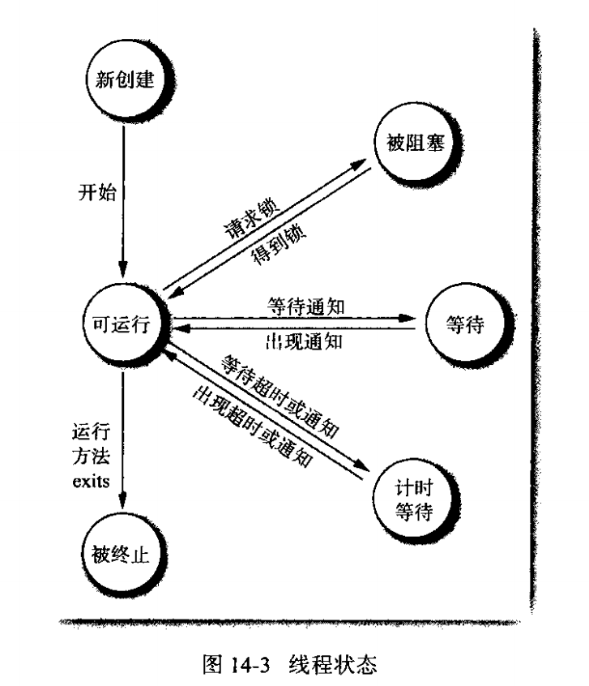

# 多线程基础

## 1.线程与进程

### 进程和线程之间有什么不同？

一个进程是一个独立(self contained)的运行环境，它可以被看作一个程序或者一个应用。而线程是在进程中执行的一个任务。线程可以被称为轻量级进程。线程需要较少的资源来创建和驻留在进程中，并且可以共享进程中的资源。

## 2.线程的创建和启动

Java中有两种途径创建线程。

### 2.1继承Thread类

Thread类代表线程类，它的最主要的两个方法是：

- run()：包含线程运行时要执行的代码
- start()：用于启动线程

```java
class MyThread extends Thread {
    @Override
    public void run() {
        for (int i = 0; i < 10; i++) {
            System.out.println(Thread.currentThread().getName() +"--"+ i);
        }
    }
    // 启动线程
    public static void main(Strig[] args){
        MyThread thread = new MyThread();
		thread.start();
    }
}
```

**关于调用Thread类的run()方法**

如果我们调用了Thread的run()方法，它的行为就会和普通的方法一样，为了在新的线程中执行我们的代码，必须使用Thread.start()方法。

### 2.2实现Runnable接口

由于Java不支持多继承，也就是说如果我们继承了Thread类，就不能继承其他类。

为了解决这个问题，Java提供了Runnable接口。

```java
class MyRunnable implements Runnable {
    @Override
    public void run() {
        for (int i = 0; i < 10; i++) {
            System.out.println(Thread.currentThread().getName() +"--"+ i);
        }
    }
    // 启动线程
    public static void main(String[] args) {
      Thread thread = new Thread(new MyThread());
      thread.start();
	}
}
```

## 3.线程的状态

线程在它的生命周期中会处于各种不同的状态

### 3.1新建状态

用new语句创建的线程对象处于新建状态。

### 3.2可运行状态

调用了线程的start()方法，线程就处于可运行状态。这个状态下的线程，可能正在运行，也可能没有。

### 3.3阻塞状态

当线程处于运行状态，试图获取某个对象的同步锁时，如果该对象的同步锁已经被其他线程占用，Java虚拟机会把这个线程放到这个对象的锁池中，该线程也就进入了阻塞状态。。

### 3.4等待状态

当线程等待另一个线程通知调度器一个条件时，例如调用Object.wait、Thread.join、或者等待Lock、Condition的时候，就会进入等待状态

### 3.5终止状态

当线程执行完run方法，或者在执行过程中出现了异常，那么该线程就会退出，然后进入终止状态。



## 4.获取当前线程的引用

Thread类的currentThread静态方法返回当前线程对象的引用。

## 5.线程的调度

线程的调度是指按照特定的机制为多个线程分配cpu的使用权，有两种调度模型：分时调度模型和抢占式调度模型。

分时调度模型是让所有线程轮流获得CPU的使用权，并且平均分配每个线程占用CPU的时间片。

Java虚拟机采用抢占式调度模型，它是指优先让可运行池中的优先级高的线程占用CPU，如果可运行池中线程的优先级相同，那么就随机地选择一个线程，使其占用CPU。

### 5.1调整各个线程的优先级

Thread类提供了getPriority(int)和getPripority()方法设置和读取优先级。优先级的取值范围是1~10，越大有越优先，默认优先级为5。Thread类提供了3个静态变量，分别用来对应三个优先级，分别是

- MAX_PRIORITY:10 
- NORM_PRIORITY:5
- MIN_PRIPROTY:1

虽然说是分了10个优先级，但不是所有操作系统的支持的，所以一般推荐使用上面三个静态变量。

### 5.2线程的睡眠、让步、等待

**睡眠**：调用线程的静态sleep方法，它就会放弃CPU，转到阻塞状态。

**让步**：调用线程的静态yield方法，如果此时具有相同优先级的其他线程处于就绪状态，该方法就会把当前运行的线程放到可运行池中，并运行那个线程。

**等待**：当前运行的线程可以调用另外一个线程的join()方法，当前运行的线程将等待直到另一个线程运行结束，它才会恢复运行。

## 6.守护线程

Java中有两类线程：User Thread(用户线程)、Daemon Thread(守护线程)

用户线程即运行在前台的线程，而守护线程是运行在后台的线程。 守护线程作用是为其他前台线程的运行提供便利服务，而且仅在普通、非守护线程仍然运行时才需要，比如垃圾回收线程就是一个守护线程。当JVM检测仅剩一个守护线程，而用户线程都已经退出运行时，JVM就会退出。如果有非守护线程仍然存活，JVM就不会退出。

守护线程并非只有虚拟机内部提供，用户在编写程序时也可以自己设置守护线程。用户可以用Thread的setDaemon（true）方法设置当前线程为守护线程。

虽然守护线程可能非常有用，但必须小心确保其他所有非守护线程消亡时，不会由于它的终止而产生任何危害。因为你不可能知道在所有的用户线程退出运行前，守护线程是否已经完成了预期的服务任务。一旦所有的用户线程退出了，虚拟机也就退出运行了。 因此，不要在守护线程中执行业务逻辑操作（比如对数据的读写等）。


