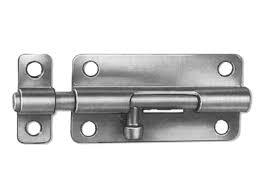

阻塞队列是一种特殊的集合类，它不仅拥有容器的作用，还能协调生产者和消费者线程的控制流程。

那些可以通过自身状态来协调线程的的控制流程的对象，叫做同步者（Synchronizers）。

阻塞队列可以算是一种同步者，除此之外，JDK还提供了一些其它的同步者，分别是Latch、Semaphore、Barrier。

## Latch

Latch：**a device for keeping a door or gate closed, consisting of a metalbar that fits into a hole and is lifted by pushing down on another bar.**

门栓、闭锁



**什么是闭锁？**

闭锁作为一种同步工具类，它的作用相当于有一扇门，在闭锁打开之前，这扇门是无法打开的，因此任何线程都无法通过这扇门，当条件允许时，闭锁就会被打开，大门将永远保持打开。

**闭锁的作用？**

闭锁可以用来确保某些活动会在另一些活动完成之后才进行。例如：

- 确保某个计算它所需要的资源，在计算之前就已经被准备好
- 确保某个服务在进行之前，它所依赖的其它服务已经准备好了

### CountDownLatch

闭锁的实现就是`CountDownLatch`。

构造CountDownLatch的时候需要给定一个计数量（count），每次调用countDown()方法就会减少一次，当计量数为0的时候，唤醒所有等待中的线程。

CountDownLatch有两个重要方法，一个是`countDown` 使计时器减1，一个是`await` 阻塞当前线程直到计时器为0。

```java
public class CountDownLatch {
    /**
     * Synchronization control For CountDownLatch.
     * Uses AQS state to represent count.
     */
    private static final class Sync extends AbstractQueuedSynchronizer {//...}
    private final Sync sync;
    public CountDownLatch(int count) {...}
    public void await() throws InterruptedException {...}
    public boolean await(long timeout, TimeUnit unit)
        throws InterruptedException {...}

    public void countDown() {...}
    public long getCount() {...}
    public String toString() {...}
}
```

**例子**

```java
class Driver { // ...
   void main() throws InterruptedException {
     CountDownLatch doneSignal = new CountDownLatch(N);
     Executor e = ...

     for (int i = 0; i < N; ++i) // create and start threads
       e.execute(new WorkerRunnable(doneSignal, i));
     doneSignal.await();           // wait for all to finish
   }
 }

 class WorkerRunnable implements Runnable {
   private final CountDownLatch doneSignal;
   private final int i;
     
   WorkerRunnable(CountDownLatch doneSignal, int i) {
     this.doneSignal = doneSignal;
     this.i = i;
   }
     
   public void run() {
     try {
       doWork(i);
       doneSignal.countDown();
     } catch (InterruptedException ex) {} // return;
   }

   void doWork() { ... }
 }
```

## Barrier

屏障

屏障的作用是等待一组线程，等到这组线程全部都到达屏障，才让他们通过。

### CyclicBarrier

屏障的实现就是`CyclicBarrier`。

`CyclicBarrier`可以使一定数量的参加者反复地在屏障出集合，当线程到达屏障位置时，它调用await方法，这个方法会阻塞，直到有所线程都到达屏障位置。如果线程都达到了，屏障将会打开。如果await调用超时或者await阻塞的线程被打断，那么屏障就认为是被打破了，所有阻塞的await调用都会被终止并且抛出`BrokenBarrierException`。 

## Phaser

Phaser是一个用来实现线程同步的工具类。我把Phaser叫做阶段管理器，每个阶段需要完成规定数量的任务才能进入下一个阶段。每个阶段需要完成的任务可以动态调整。

```java
// 入门例子
public static void main(String[] args){
    Phaser phaser = new Phaser(2); // 初始化一个阶段管理器,规定每个阶段完成2个任务才能进入下一个阶段
    System.out.println("当前阶段:" + phaser.getPhase()); // 0
    phaser.arrive(); // 已完成一个任务，但还差一个
    System.out.println("当前阶段:" + phaser.getPhase()); // 0 
    phaser.arrive(); // 两个任务已完成，进入下一阶段
    System.out.println("当前阶段:" + phaser.getPhase()); // 1 
    //---------------------------------------------------------------
    phaser.arriveAndDeregister();// 已完成一个任务，并且下阶段需要完成的任务数减1
    phaser.arrive(); // 两个任务已完成，进入下一阶段
    System.out.println("当前阶段:" + phaser.getPhase()); // 2
    //---------------------------------------------------------------
    phaser.arrive(); // 完成一个任务,由于该阶段只需要完成一个任务，所以进入下一阶段
    System.out.println("当前阶段:" + phaser.getPhase()); // 3
    //---------------------------------------------------------------
    phaser.register();// 从该阶段开始，需要完成的任务数加1
    phaser.arrive(); // 已完成一个任务，但还差一个
    System.out.println("当前阶段:" + phaser.getPhase()); // 3
    phaser.arrive(); // 两个任务已完成，进入下一阶段
    System.out.println("当前阶段:" + phaser.getPhase()); // 4
}
```

```java
// 这个东西一般是多个线程同时使用
public static void main(String[] args) throws InterruptedException {
   Phaser phaser = new Phaser(2);

   Thread t1 = new Thread(() -> {
      System.out.println("我是线程1，当前阶段:" + phaser.getPhase()); // 0
      phaser.arriveAndAwaitAdvance();// 完成一个任务并阻塞当前线程直到进入下一个阶段
      System.out.println("我是线程1，当前阶段：" + phaser.getPhase()); // 1
   });

   Thread t2 = new Thread(() -> {
      try {
         Thread.sleep(1000); // 保证线程1先完成任务
         phaser.arrive();
      } catch (InterruptedException e) {
         e.printStackTrace();
      }
   });


   t1.start();
   t2.start();

   t1.join();
   t2.join();
}
```

**深入理解**

- phaser和phase

  Phaser把一组任务的执行分为多个阶段(phase),到达阶段后，任务可以选择进入下一阶段或者停止执行。

- party

  通过phaser实现同步的线程被称为party.这个party并没有特别的含义,只是Oracle官方的命名.所有需要同步的party必须持有同一个phaser对象.party需要向phaser注册,执行`phaser.register()`方法注册,该方法仅仅是增加phaser中的线程计数.也可以通过构造器注册,比如`new Phaser(5)`就会在创建phaser对象时注册5个party,随后这5个party只要持有该phaser对象并调用该对象的API就能实现同步.

- arrived和unarrived
  party到达某个阶段之前处于unarrived状态,到达时处于arrived状态.一个arrived的party也被称为arrival.

- deregister

  一个线程可以在到达(arrive)某个阶段(phase)后退出(deregister),此时可以使用arriveAndDeregister()方法.

- phase计数

  Phaser类有一个phase计数,初始阶段为0.当一个阶段的所有线程到达(arrive)时,会将phase计数加1,这个动作被称为advance.当这个计数达到Integer.MAX_VALUE时,会被重置为0,不过相信很多程序不可能达到这个值.

  advace这个词出现在Phaser类的很多api里,比如arriveAndAwaitAdvance()、awaitAdvance(int phase)等.

  在advance过程中,会触发`boolean onAdvance(int phase, int registeredParties)`方法的执行.

  该方法可以让我们在进入下一阶段之前执行一些操作。

  可以在这个方法中定义advance过程中需要执行何种操作,如果进入下一阶段(phase)执行,返回false.如果返回true,会导致phaser结束,因此该方法也是终止phaser的关键所在.

- Tiering

  Tiering即分层的意思.Phaser支持分层结构，即通过构造函数Phaser(Phaser parent)和Phaser(Phaser parent, int parties)构造一个树形结构。这有助于减轻因在单个的Phaser上注册过多的任务而导致的竞争，从而提升吞吐量，代价是增加单个操作的开销。


## Exchanger

Exchanger是另一种形式的屏障，用于线程间的数据交换，等到双方都到达各自的屏障时，这两个线程可以进行数据交换。

## Semaphore

Semaphore是一种基于计数的信号量。它可以设定一个阈值，基于此，多个线程竞争获取许可信号，做完自己的申请后归还，超过阈值后，线程申请许可信号将会被阻塞。Semaphore可以用来构建一些对象池，资源池之类的，比如数据库连接池，我们也可以创建计数为1的Semaphore，将其作为一种类似互斥锁的机制，这也叫二元信号量，表示两种互斥状态。

```java
 class Pool {
   private static final int MAX_AVAILABLE = 100;
   private final Semaphore available = new Semaphore(MAX_AVAILABLE, true);

   public Object getItem() throws InterruptedException {
     available.acquire();
     return getNextAvailableItem();
   }

   public void putItem(Object x) {
     if (markAsUnused(x))
       available.release();
   }

   // Not a particularly efficient data structure; just for demo

   protected Object[] items = ... whatever kinds of items being managed
   protected boolean[] used = new boolean[MAX_AVAILABLE];

   protected synchronized Object getNextAvailableItem() {
     for (int i = 0; i < MAX_AVAILABLE; ++i) {
       if (!used[i]) {
          used[i] = true;
          return items[i];
       }
     }
     return null; // not reached
   }

   protected synchronized boolean markAsUnused(Object item) {
     for (int i = 0; i < MAX_AVAILABLE; ++i) {
       if (item == items[i]) {
          if (used[i]) {
            used[i] = false;
            return true;
          } else
            return false;
       }
     }
     return false;
   }
 }
```

