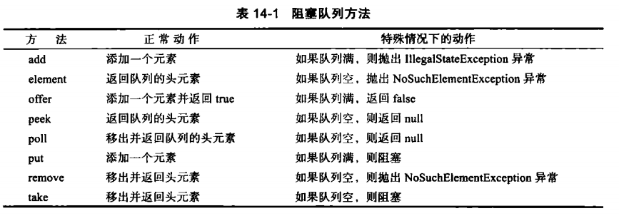

# BlockingQueue

对于许多线程问题，我们可以通过使用一个或多个线程安全的队列来进行规避。生产者向队列插入元素，消费者从队列取出它们。使用队列可以安全地从一个线程向另一个线程传递数据。实现一个线程安全的队列还是很难的，不过Java已经有现成的提供给我们了。BlockingQueue（阻塞队列），当试图向已满的队列添加元素，或者从空队列获取元素时，阻塞队列会阻塞当前线程。



**练习**

一个文本关键字扫描程序，给定一个目录，递归扫描该目录下所有文件，找出关键字在文件中所在的位置。

```java
public class BlockingQueueTest {

   // the capacity of the file queue
   private static final int FILE_QUEUE_SIZE = 10;
   // the number of the search thread
   private static final int SEARCH_THREAD = 99;

   public static void main(String[] args) throws InterruptedException {
      Scanner in = new Scanner(System.in);
      System.out.println("Enter base directory (e.g. /home/hdr/Desktop/HDR-Note):");
      String baseDir = in.nextLine();
      System.out.println("Enter keyword (e.g. java):");
      String keyword = in.nextLine();
      
      ExecutorService executorService = Executors.newFixedThreadPool(100);
      ArrayBlockingQueue<File> fileQueue = new ArrayBlockingQueue<>(FILE_QUEUE_SIZE);
      executorService.submit(new FileEnumerationTask(fileQueue, new File(baseDir)));
      for (int i = 0; i < SEARCH_THREAD; i++) {
         executorService.submit(new SearchTask(fileQueue, keyword));
      }
      executorService.shutdown();
      executorService.awaitTermination(1, TimeUnit.HOURS);

   }

}
```

```java
public class FileEnumerationTask implements Runnable {

   public static File DUMMY = new File("");
   private BlockingQueue<File> queue;
   private File startingDirectory;

   public FileEnumerationTask(BlockingQueue<File> queue, File startingDirectory) {
      System.out.println("create FileEnumerationTask");
      this.queue = queue;
      this.startingDirectory = startingDirectory;
   }

   @Override
   public void run() {
      try {
         enumearte(startingDirectory);
         queue.put(DUMMY);
      } catch (InterruptedException e) {
         e.printStackTrace();
      }
   }

   public void enumearte(File directory) throws InterruptedException {
      File[] files = directory.listFiles();

      for (File file : files) {
         if (file.isDirectory())
            enumearte(file);
         else
            queue.put(file);
      }
   }
}
```

```java
public class SearchTask implements Runnable {

   private BlockingQueue<File> queue;
   private String keyword;

   public SearchTask(BlockingQueue<File> queue, String keyword) {
      this.queue = queue;
      this.keyword = keyword;
   }

   @Override
   public void run() {

      try{
         boolean done = false;
         while (!done) {
            File file = queue.take();
            if (file == FileEnumerationTask.DUMMY) {
               queue.put(file);
               done = true;
            }
            else{
               search(file);
            }
         }
      } catch (InterruptedException | IOException e) {
         e.printStackTrace();
      }

   }


   public void search(File file) throws IOException{
      try (Scanner in = new Scanner(file)) {
         int lineNumber = 0;
         while (in.hasNextLine()) {
            lineNumber++;
            String line = in.nextLine();
            if (line.contains(keyword)) {
               System.out.printf("%s:%d:%s%n", file.getPath(), lineNumber, line);
            }
         }
      }
   }


}
```

# 线程安全的集合

-   `ConcurrentLinkedQueue`
-   `ConcurrentLinkedDeque`
-   `ConcurrentHashMap`
-   `ConcurrentSkipListMap`
-   `ConcurrentSkipListSet`

