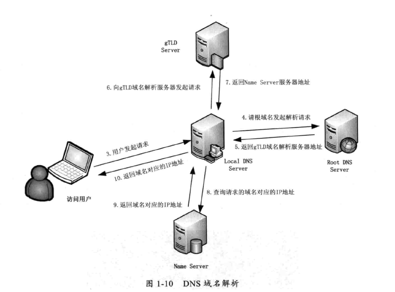
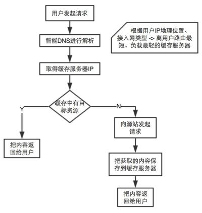

# Web请求的过程

## 打开网页的基本流程

- 浏览器输入网址
- 对网址进行域名解析,获取IP地址
- 根据IP地址对服务器发起HTTP请求
- 服务接受请求、处理请求、返回响应

## HTTP

## DNS

DNS是Domain Name System域名系统的简称，它是域名和IP地址相互映射的一个分布式数据库，能够使用户更方便的访问互联网，而不用去记住能够被机器直接读取的IP数串。

根据域名获取对应IP地址的行为叫做域名解析。

浏览器会对域名解析进行缓存。

操作系统会对域名解析进行缓存。

- windows系统域名解析缓存文件: C:\Windows\System32\drivers\etc\hosts
- linux系统域名解析缓存文件: /etc/hosts

如果浏览器,和操作系统都没有对该域名的解析缓存。

- LDNS 本地区的域名服务器,网络供应提供的对域名解析进行缓存的服务器。
- gTLDS  generic Top level 域名服务器,如.com .cn等等
- Name Server 通常就是你注册的域名服务器。例如你在阿里云买了域名,这个域名解析任务就由域名提高商的服务器来完成。
- TTL time to live 保留时间

## 几种域名解析方式

- A记录
- MX记录
- CNAME记录
- NS记录
- TXT记录

A记录,A是Address的意思,就是把该域名指向一个IP地址。

MX记录,MX是 Mail Exchange的意思,它指向一个邮件服务器，用于电子邮件系统发邮件时根据 收信人的地址后缀来定位邮件服务器。

CNAME记录,Canonical Name(别名解析),把该域名指向另一个域名。

NS记录,为某个域名指定DNS解析服务器

TXT记录,为某个主机名/域名设置说明

## CDN工作机制

CDN content delivery network(内容传输网络),

CDN主要功能是在不同的地点缓存内容，通过负载均衡技术，将用户的请求定向到最合适的缓存服务器上去获取内容，比如说，是北京的用户，我们让他访问北京的节点，深圳的用户，我们让他访问深圳的节点。通过就近访问，加速用户对网站的访问。解决Internet网络拥堵状况，提高用户访问网络的响应速度。

CDN网络是在用户和服务器之间增加缓存层，将用户的访问请求引导到最优的缓存节点而不是服务器源站点，从而加速访问速度。

**完整的CDN工作流程：**

# Servlet与Web容器

## 什么是Servlet?

servlet是能完成特定功能的Java代码,这个特定功能就是接收HttpServletRequest对象,返回HttpServletResponse对象。

## 什么是Web容器?

Web应用服务器,是一个Servlet/JSP容器

拆包装:接收客户发来的http请求文本并解析，然后转化成Java servlet能处理的HttpServletRequest类型对象.

打包装:把Java servlet返回的HttpResponse类型对象包装成响应文本的格式,然后返回给客户.

**总结**

- Java Servlet运行在Tomcat中,Tomcat运行在服务器中.
- 服务器接收请求,把请求交给Tomcat,Tomcat对请求进行解析后,把内容交给Java Servlet处理，然后Servlet返回响应，容器再对响应进行处理，然后返回给用户。

