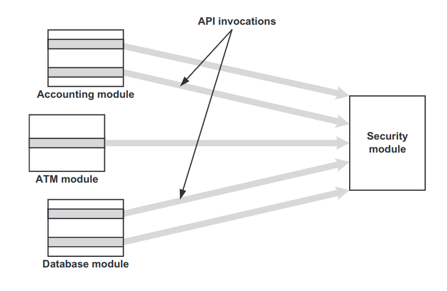
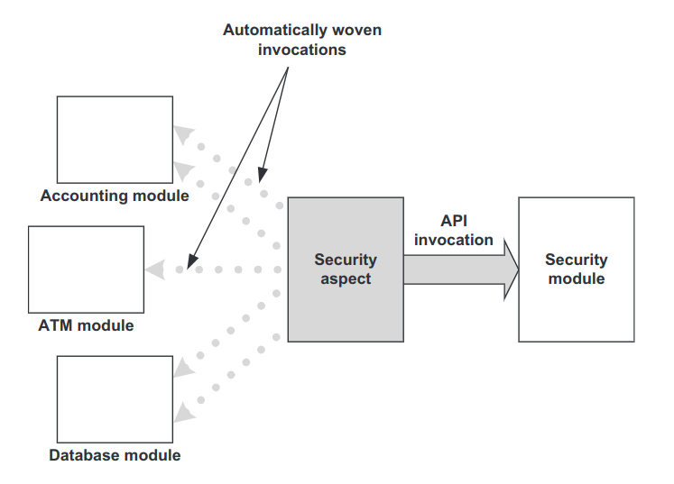

# AOP

## 1.1什么是AOP

AOP，面向切面编程，是一种编程思想，通过切面(aspect)实现横切关注点的统一管理。横切关注点：指的是一些具有横跨多个模块的行为。例如权限认证、日志、缓存、事务管理等等。

>   按照功能对一个系统进行划分，我们得到一个个关注点。关注点分为核心关注点和横切关注点。核心关注点完成业务的核心功能。横切关注点分散于核心关注点的各处，为核心关注点提供服务，例如日志、安全认证、、事务管理等。
>

下图是没有使用AOP时的情况



下图是使用AOP时的情况



可以看出，在没有使用AOP时，安全模块处于被动调用的情况，我们很难对它的调用者进行统一管理。

而使用AOP时，安全模块通过切面可以主动选择它的调用者，从而实现对调用者的统一管理。

## 1.2AOP基本术语

- join point：在程序运行期间，程序会暴露出一些点（`point`），例如方法的执行、创建对象、抛出异常等等。我们可以在这些点上插入切面，实现功能扩展。这些点就叫做`joint point`。
- pointcut：`join point`有很多，我们要从中选择出满足我们需求的点，根据某些条件选出来的点，就叫做`pointcut`。
- advice：`advice`是在`joint point`中执行的行为，例如安全认证，事务管理等等。
- aspect：`aspect`（切面）是一个实现横切关注点的模块单元。`aspect`里面包含了`advice`和`join point`。（做什么？对谁做？）
- weaving：`把核心功能和切面组合在一起的过程叫做weaving`（编织）。

## 1.3AOP的种类

AOP分为动态AOP和静态AOP，这两者的区别在于编织过程（weaving process）是何时发生，以及如何实现。

从Java的角度来说，静态AOP就是在编译时期，对字节码文件进行修改和扩展。从性能上来讲，静态AOP比动态AOP要好，缺点就是对切面修改后，需要对整个应用进行重新编译。

对比之下不难理解，动态AOP就是在程序运行过程中执行编织过程，具体这个怎么实现，要看你所使用的框架，例如Spring的话是通过动态代理实现的。

## 2.AspectJ


### Mapping pointcuts

定义好切面后，我们就需要添加pointcuts。我们通过@Pointcut注解表示一个pointcut。这个注解的值就是pointcut表达式。

举例说明:

```java
execution("修饰符 类路径 方法名(方法参数)")
    
// 任意公共方法的执行：
execution("public * *(..)")
    
// 任何一个以“set”开始的方法的执行：
execution("* set*(..)")
    
// AccountService 接口的任意方法的执行：
execution("* com.xyz.service.AccountService.*(..)")
    
// 定义在service包里的任意方法的执行：
execution("* com.xyz.service.*.*(..)")
    
//定义在service包和所有子包里的任意类的任意方法的执行：
execution("* com.xyz.service..*.*(..)")
    
//定义在pointcutexp包和所有子包里的JoinPointObjP2类的任意方法的执行：
execution("* com.test.spring.aop.pointcutexp..JoinPointObjP2.*(..))")
```


## 3.Spring AOP

### 3.1编程式AOP

`Pro Spring5 ch5`

### 3.2声明式AOP

声明式AOP有三种用法，分别是@AspectJ风格的注解、XML命名空间、ProxyFactoryBean。

#### 3.2.1使用@AspectJ风格的注解

为了使用@AspectJ风格的注解，我们需要了解@AspectJ语法。

| 注解            | 描述           |
| --------------- | -------------- |
| @Aspect         | 声明一个切面   |
| @Pointcut       | 声明一个切入点 |
| @Before         |                |
| @After          |                |
| @AfterReturning |                |
| @AfterThrowing  |                |
| @Around         |                |

```java

// @Pointcut这个注解就是用来找pointcut的 
---------------------------------------------------------------------
// execution([访问修饰符] 返回类型 [类全限定名].方法名(参数) [异常])
// 切入点表达式通配符：
  // * 匹配所有字符  
  // ..一般用于匹配多个包，多个参数  
  // + 表示类及其子类
// ("execution (* com.sample.service.impl..*.*(..))")
// execution(): 表达式主体
// 第一个*号：表示返回类型，*号表示所有的类型
// com.sample.service.impl 包名
// ..: 表示包路径，..表示当前包和当前包的所有子包
// 第二个*号：表示类名，*号表示所有的类
// 第三个*好：表示方法名,号表示所有的方法
// ..: 表示参数，..表示所有参数
---------------------------------------------------------------------
// within()
//匹配Person类中的所有方法
@Pointcut("within(com.cjm.model.Person)")
public void pointcut(){}  
//匹配com.cjm包及其子包中所有类中的所有方法
@Pointcut("within(com.cjm..*)")
public void before(){}
// 其余的自己上网找
```


```java
public class Singer {
	public void sing() {
		System.out.println("Hello world");
	}
}
// ----------------------------------------------------------------------
@Component
@Aspect
public class SingerAspect {

	@Pointcut("execution(public void com.hdr.learn.aop..Singer.*(..))")
	public void singerPointCut() {}

	@Before("singerPointCut()")
	public void beforeAdvice(JoinPoint point) {
		System.out.println("触发了前置通知！");
	}

	@After("singerPointCut()")
	public void afterAdvice(JoinPoint point) {
		System.out.println("触发了后置通知，抛出异常也会被触发！");
	}

	@AfterReturning(pointcut = "singerPointCut()", returning = "ret")
	public void afterReturningAdvice(JoinPoint point, Object ret) {
		System.out.println("触发了返回后通知，抛出异常时不被触发，返回值为：" + ret);
	}

	@AfterThrowing(pointcut = "singerPointCut()", throwing = "throwing")
	public void afterThrowsAdvice(JoinPoint point, RuntimeException throwing) {
		System.out.println("触发了异常通知，抛出了RuntimeException异常！");
	}

	@Around("singerPointCut()")
	public Object aroundAdvice(ProceedingJoinPoint point) throws Throwable {
		System.out.println("触发了环绕通知 开始");
		Object o = point.proceed();
		System.out.println("触发了环绕通知 结束");
		return o;
	}
}

// ----------------------------------------------------------------------
@Configuration
@ComponentScan("com.hdr.learn.aop")
@EnableAspectJAutoProxy(proxyTargetClass = true)
public class AppConfig {

	@Bean
	public Singer singer() {
		return new Singer();
	}

	public static void main(String[] args) {
		AnnotationConfigApplicationContext ctx = new AnnotationConfigApplicationContext(AppConfig.class);
		Singer singer = ((Singer) ctx.getBean("singer"));
		singer.sing();
	}
}
```


