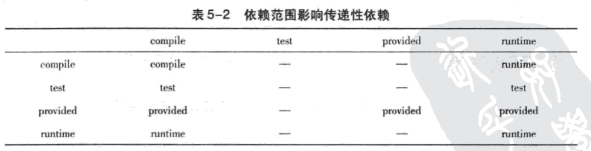

# Maven入门

## Maven是什么？

Maven可以翻译作“知识的积累”，也可以翻译为“专家”或“内行”。Maven主要提供的服务是基于Java平台的项目构建、依赖管理、项目信息管理。

**什么是构建？**

在开发中，除了编写代码，我们还需要做编译、单元测试、生成文档、打包和部署等重复的事情，这就是构建。

## 一个例子

这是一个运用了策略模式的加密器，用来对字符串进行加密。

```xml
<?xml version="1.0" encoding="UTF-8"?>
<project xmlns="http://maven.apache.org/POM/4.0.0"
         xmlns:xsi="http://www.w3.org/2001/XMLSchema-instance"
         xsi:schemaLocation="http://maven.apache.org/POM/4.0.0 http://maven.apache.org/xsd/maven-4.0.0.xsd">
    <modelVersion>4.0.0</modelVersion> <!--当前POM的版本-->
    <groupId>com.hdr.learn.DesignPattern</groupId>
    <artifactId>DesignPattern</artifactId>
    <version>1.0-SNAPSHOT</version>
  	<!--
			groupId、artifactId、version这三个元素定义了一个项目的基本坐标
		-->
  	
    <build>
        <plugins>
            <plugin>
                <groupId>org.apache.maven.plugins</groupId>
                <artifactId>maven-compiler-plugin</artifactId>
                <version>3.1</version>
                <configuration>
                    <target>1.8</target>
                    <source>1.8</source>
                </configuration>
            </plugin>
        </plugins>
    </build>
</project>
```

# 坐标、依赖配置、仓库

## 坐标

由于Java使用者多，它们创造了大量构件，也就是平时用的一些jar、war等文件。Maven其中一个作用就是方便我们下载和管理这些构件。在Maven世界中，我们通过groupId、artifactId、version这三个元素定义了一个构件的基本坐标。有了这个坐标，我们就能从Maven提供的中央仓库中下载所需的构件。

## 依赖配置

```xml
<dependencies>
    <dependency>
        <groupId>junit</groupId>
        <artifactId>junit</artifactId>
        <version>4.12</version>
        <scope>test</scope>
    </dependency>
</dependencies>
```

- groupId、artifactId、version
- type：依赖的类型，默认为jar
- scope：依赖的范围
- optional：依赖是否可选
- exclusions：用来排除传递性依赖

## 依赖的范围

Maven在编译项目主代码的时候需要使用一套classpath、测试代码的时候会使用另一套classpath、运行的时候，又会使用一套classpath。依赖范围就是对这三个classpath起作用。

- compile：编译依赖范围。默认，对于编译、测试、运行classpath都有效。

- test：测试依赖范围。只对测试classpath有效，典型例子junit。

- provided：对于编译和测试时有效，但在运行时无效。典型例子servlet-api。

- runtime：运行时依赖。对于测试和使用有效，但是编译时无效。典型例子JDBC驱动。

- system：本地Maven仓库之外的类库文件。对于编译和测试时有效，但在运行时无效。

  ```xml
  <dependency>
      <groupId>xxx</groupId>
      <artifactId>xx</artifactId>
      <version>1.0</version>
      <scope>system</scope>
      <systemPath>${path-to-the-jar}</systemPath>
  </dependency>
  ```

## 依赖的传递

项目A需要项目B，使用Maven导入项目A的时候，它会自动帮我们导入项目B。

最左边一列是项目A的依赖范围取值，最上面一行是项目B的依赖范围取值。

## 依赖冲突

有些时候，导入的两个项目可能会依赖于同一个项目，但是依赖的项目版本不一样，这时候，

1. 根据路径来选择，导入路径更短的依赖

2. 如果路径相等，先声明的先导入

3. 排除掉其中一个

   ```xml
   <dependency>
       <groupId>org.springframework</groupId>
       <artifactId>spring-context</artifactId>
       <version>5.1.5.RELEASE</version>
       <exclusions>
           <exclusion>
               <groupId>org.springframework</groupId>
               <artifactId>spring-aop</artifactId>
           </exclusion>
       </exclusions>
   </dependency>
   ```

## 可选依赖

A依赖B，X、Y是B的可选依赖。这时候X、Y不会对A有任何作用。

## 仓库分类

- 本地仓库
- 远程仓库
  - 中央仓库
  - 其他公共仓库
  - 私服

本地仓库默认在`~/.m2/repository`,如果想修改本地仓库存储位置，可以修改`~/.m2/settings.xml`，当然这个配置文件默认是不存在，需要我们复制maven项目conf目录下的settings.xml。

把当前项目添加到本地仓库`mvn clean install`。

**远程仓库的配置**

**远程仓库的认证**

```xml
<settings>
...
    <servers>
    	<server>
        	<id></id> <!--仓库id-->
            <username></username>
            <password></password>
        </server>
    </servers>
</settings>
```

**把构件部署到远程仓库**

```xml
<project>
...
    <distributionManagement>
    	<repository>
        	<id></id>
            <name></name>
            <url></url>
        </repository>
        <snapshotRepository>
        	<id></id>
            <name></name>
            <url></url>
        </snapshotRepository>
    </distributionManagement>
</project>

<!--配置正确后，运行 mvn clean deploy将会把项目部署到远程仓库中-->
```

**想一想为什么要有发布版本和快照版本、以及版本号的命名规则**

# 生命周期与插件

Maven生命周期包含了项目的清理、初始化、编译、测试、打包、集成测试、验证、部署和站点生产等几乎所有构建步骤。Maven生命周期只是负责抽象，具体的实现是通过插件来完成的。Maven默认为我们提供了一些插件，例如编译周期提供了`maven-compile-plugin`、测试周期提供了`maven-surefire-plugin`。

Maven拥有三套相互独立的生命周期。每个生命周期含有一些阶段（phase）

- clean：清理项目
- default：构建项目 [官方文档](https://maven.apache.org/guides/introduction/introduction-to-the-lifecycle.html)
- site：？？？

## 插件目标

一个插件往往能完成多个目标。例如`maven-dependency-plugin`插件提供了不少的目标。

`mvn dependency:tree`、`mvn dependency:list`

## 插件绑定

