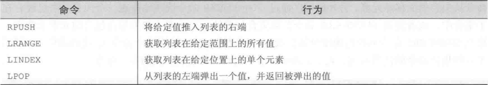

## Redis数据结构简介

Redis是一个使用客户端-服务器模式的key-value类型数据库，Redis服务器管理着多个Redis数据库，我们通过Redis客户端连接Redis服务器，对Redis数据库执行相应的操作。Redis数据库提供了五种数据结构给我们存储数据，分别是字符串、列表、哈希、有序集合、无序集合。

### Redis中的字符串

`Redis`的字符串是动态字符串，是可以修改的字符串，内部结构实现上类似于 Java 的 `ArrayList`，采用预分配冗余空间的方式来减少内存的频繁分配，当字符串长度小于` 1M `时，扩容都是加倍现有的空间，如果超过 `1M`，扩容时一次只会多扩 `1M`的空间。需要注意的是字符串最大长度为 `512M`。

**自增和自减命令**

**位图与子串处理**

### Redis中的列表

Redis 的列表相当于 Java 语言里面的 LinkedList，注意它是链表而不是数组。这意味着 list 的插入和删除操作非常快，时间复杂度为 O(1)，但是索引定位很慢，时间复杂度为 O(n)，当列表弹出了最后一个元素之后，该数据结构自动被删除，内存被回收。

Redis的列表结构常用来做异步队列使用。将需要延后处理的任务结构体序列化成字符串塞进Redis的列表，另一个线程从这个列表中轮询数据进行处理。

**阻塞列表**

### Redis中的集合

底层原理

### Redis中的散列

底层原理

### Redis中的有序集合

### 其它命令

#### 过期

#### 事务

## Spring Data Redis