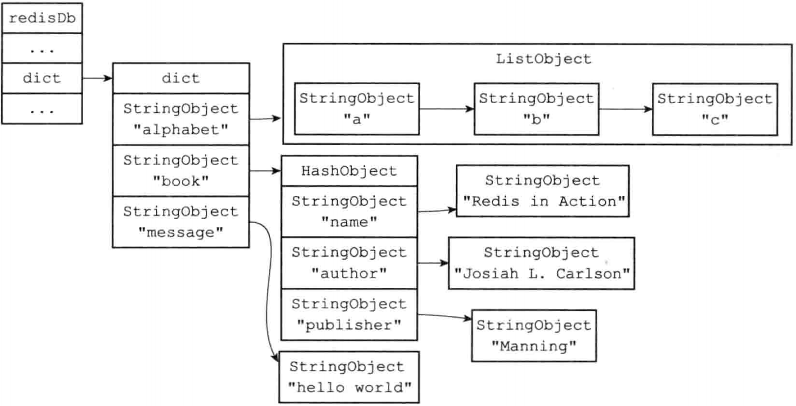
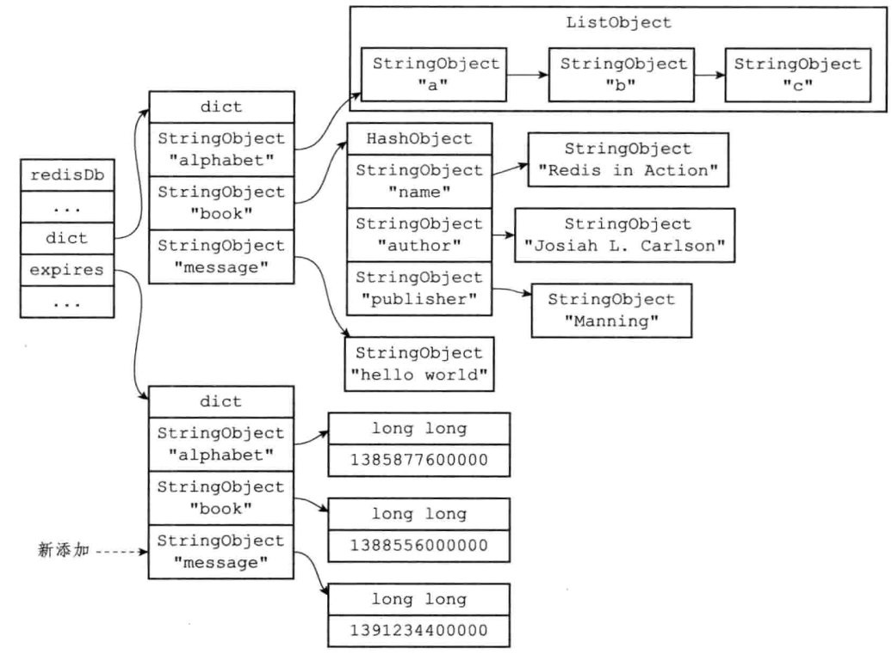
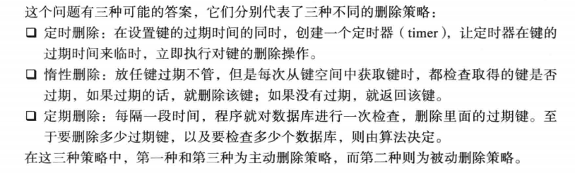
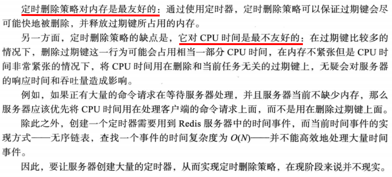
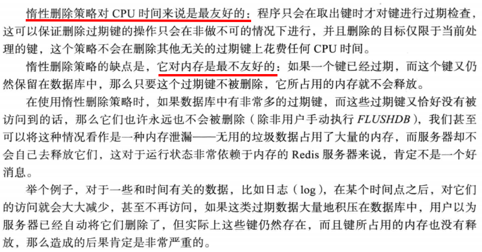
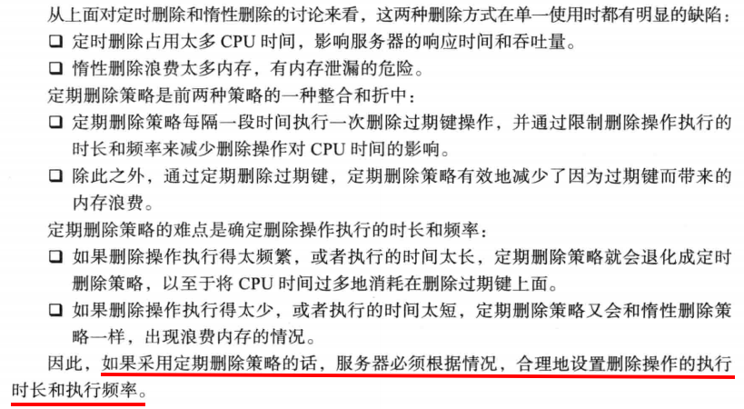
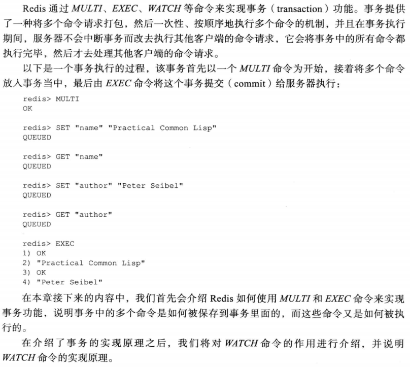

## Redis数据库

### Redis服务器上的数据库

Redis采用的是客户端-服务器架构，在服务器上面运行着多个Redis数据库。

```c
struct redisServer{
    // ...
    // 一个数组，保存着服务器中所有的数据库
    redisDb *db;
    // 数据库数量
    int dbnum;
    // ....
}
```

默认情况下，Redis客户端会操作0号数据库，我们可以通过`SELECT`命令修改操作的数据库

```
redis> SET msg "hello world"
OK
redis> GET msg
hello world
// 选择数据库1
redis> SELECT 1
OK
redis[1]> GET msg
(nil)
```

### 记录键值对的字典

在上面我们知道，Redis数据库由一种叫`redisDb`的结构所表示。其中，`redisDb`结构中存在一个`dict`结构，它保存了数据库中所有的键值对，我们将这个字典称为键空间。

```c
typedef struct redisDb{
    // ...
    // 数据库键空间，保存着数据库中的所有键值对
    dict *dict;
    // ....
} redisDb;
```

键空间和用户所见的数据库是直接对应的：

- 键空间的键也就是数据库的键，每个键都是一个字符串对象。
- 键空间的值也就是数据库的值，每个值可以是Redis五种数据结构中的任意一种。

举个例子，如果我们在空白的数据库执行以下命令：

```
redis> SET message "hello world"
ok
redis> RPUSH alphabet "a" "b" "c"
(integer) 3
redis> HSET book name "Redis in Action"
(integer) 1
redis> HSET book author "Josiah L. Carlson"
(integer) 1
redis> HSET book publisher "Manning"
(integer) 1
```

那么执行完这些命令后，数据库的键空间将会是如下图所示



### 记录键过期信息的字典

Redis支持我们对某个键设置生存时间或过期时间，这是通过`redisDb`结构中的`expires`字典实现的，该字典保存了数据库中所有键的过期时间。（生存时间：存活多久。过期时间：在什么时候过期）

Redis提供了四种命令，让我们实现上面两种功能。

```c
EXPIRE <key> <ttl>  // 生存时间，秒为单位
PEXPIRE <key> <ttl> // 生存时间，毫秒为单位
EXPIREAT <key> <timestamp> // 存活时间，秒数时间戳
PEXPIREAT <key> <timestamp> // 存活时间，毫秒数时间戳
// 其实底层都是调用PEXPIREAT
TTL <KEY> // 剩余时间，秒为单位
PTTL <KEY> // 剩余时间，毫秒为单位
PERSIST <KEY> // 取消对一个键的过期时间
```



### 过期键删除策略

在上面我们知道了如何存储键的过期信息，以及如何判断一个键是否过期，那么下一个问题就是如何删除过期的键。



**定时删除**



**惰性删除**



**定期删除**



### Redis的过期键删除策略

Redis服务器使用的是惰性删除和定时删除两种策略。

## 事务




Redis事务的本质就是使用队列，把命令存入队列中，然后再按顺序执行。如果在入队过程中出现错误，则不行执行该事务，如果是在执行队列中命令的过程中出错，事务会继续执行，数据不会回滚。

## 持久化

Redis提供两种机制实现数据的持久化，分别是RDB和AOF。

### RDB

RDB是Redis DataBase的缩写，RDB是一个经过压缩的二进制文件，通过该文件可以还原生成RDB时的数据库状态。

有两个命令创建RDB文件，分别是SAVE、BGSAVE。前者会阻塞Redis服务器进程，直到RDB文件创建完毕，后者则是创建一个子进程，由子进程生成RDB文件。我们可以通过Redis配置文件中的save选项设置多个保存条件，只要任意一个条件满足，服务器就会执行BGSAVE命令。

RDB文件的载入工作是在服务器启动时自动执行的，因此没有专门用于载入RDB文件的命令。载入RDB文件的期间，Redis服务器会处于阻塞状态。

### AOF

AOF Append Only File，通过保存Redis服务器所执行的命令来记录数据库状态。

当AOF持久化功能打开后，服务器执行完一个命令后，会将指令添加到缓冲区，然后再把缓冲区中的数据写入到AOF文件。AOF文件会越来越大，Redis提供了一条执行让我们重写AOF文件，从而减少文件的大小 BGREWRITEAOF。

### SAVE、BGSAVE、BGREWRITEAOF

在BGSAVE执行期间，服务器拒绝接受SAVE和新的BGSAVE命令。

在BGSAVE执行期间，BGREWRITEAOF命令会在BGSAVE执行之后再执行。

BGREWRITEAOF命令执行期间，服务器拒绝接受BGSAVE命令。

## 复制

## 哨兵

## 集群

