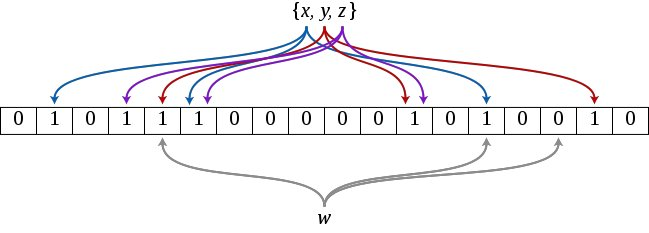

## 前言

很久之前就听说过布隆过滤器，但是一直没有去了解，今天趁着有空就去学习了一下，顺便记录记录。

## 简介

布隆过滤器，本质就是哈希函数+位图组成的一种数据结构，作用是判断某个元素是否在一个集合中，优点是空间效率和查询时间都非常高，缺点是有一定的误判率和不能删除。

## 原理

当给定一个待查询的元素时，这个元素会被一系列哈希函数计算映射出一系列的值，所有的值在位数组的偏移量设置为1。如下图所示：

如何判断某个元素是否在这个集合中呢？

元素经过相同的哈希函数计算后得到所有的偏移位置，若这些位置全都为1，则判断这个元素**可能**在这个集合中，若有一个不为1，则判断这个元素**肯定**不在这个集合中。

**优点：**可以看到就是节省空间，采用位数组，2的32次方=4294967296 可以看到42亿长度的位数组占用 4294967296/8/1024/1024=512MB 只需占用512MB的内存空间

**缺点：**有一定的误判，有可能把不在这个集合中的误判为在这个集合中

**误报概率：** 给定一个 m 位大小，k 个哈希函数的布隆过滤器，插入 n 个元素，则误报的概率为`（1 – e^(-kn/m)）^k `。

**最优哈希函数个数：** 最优哈希函数个数为 **0.7 *(m/n)**

有一个文件存了 10 亿条 URL，每条 64 字节左右。限定2G内存，使用布隆过滤器找出重复的 URL，误报概率是多少？

给 2 G 空间，k 的最优解为：`((2*1024*1024*1024*8)/1000000000)*0.7 = 12`
误报概率为：`(1-(1/e^(12*1000000000/(2*1024*1024*1024*8))))^12`
误报个数为： 260223

对于上面的问题其实有固定的套路，扫描文件 ==> hash(URL) % N 。将文件切分到 N 个不同的小文件中（原来一个文件太大约 60 G，普通机器的内存存不下。N 可以是任何正整数，只要切分后满足内存限制的要求，如 100，1000，10000等）并且相同的 URL 会存储在同一个小文件中。之后单独处理每一个小文件即可。

## Java实现

在Google的Guava包中提供了布隆过滤器的相关工具类。

