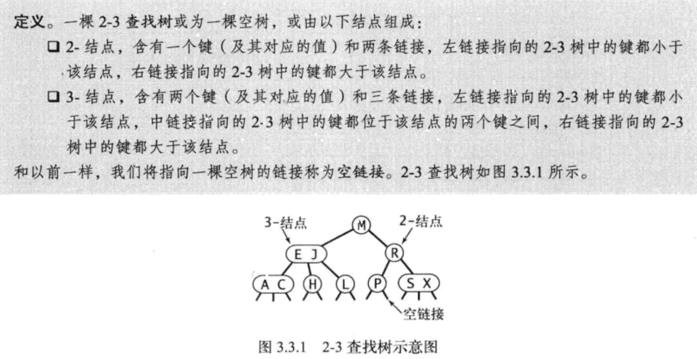
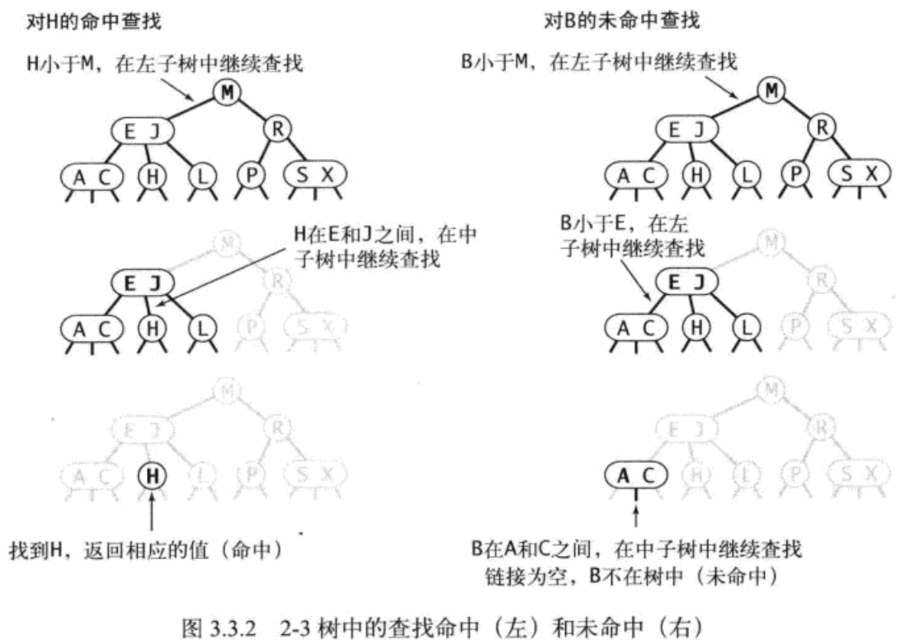
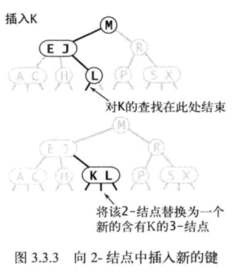
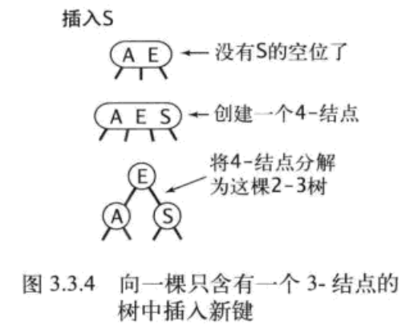
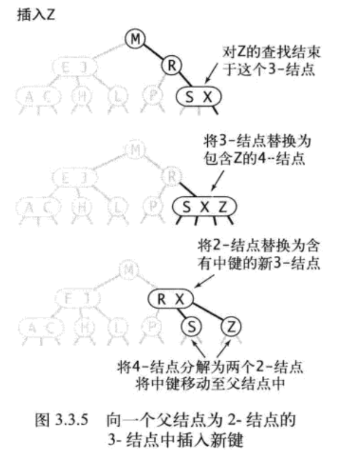
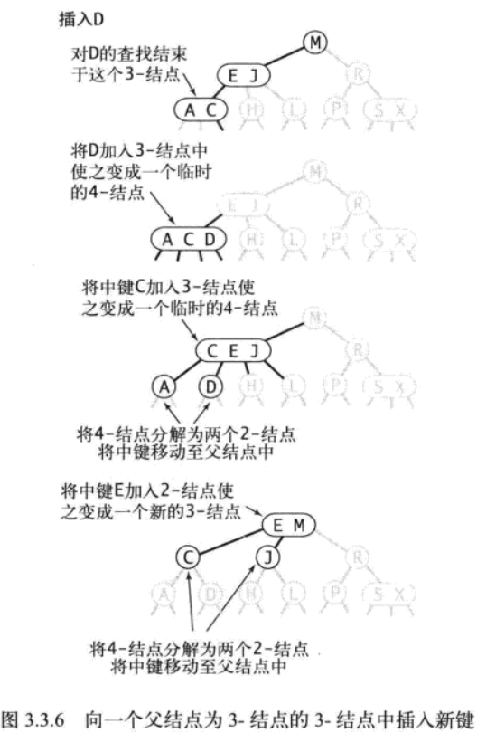
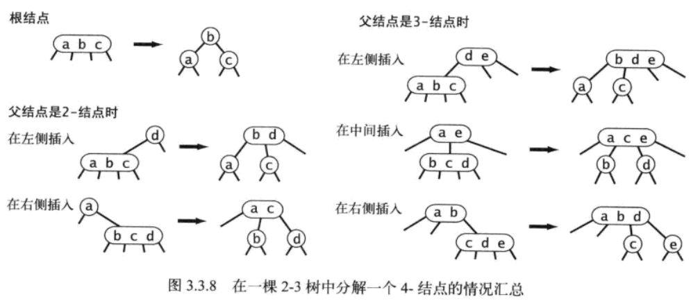

红黑树前身是2-3树，学习2-3树有利于我们理解红黑树

# 2-3树

## 简介

## 查找

2-3数的查找跟普通二叉树的查找基本相同。

## 插入

### 向2-节点插入新元素

如果未命中结束在一个2-节点，我们只需把这个2-节点转换成3-节点即可。

### 向3-节点插入新元素

#### 向一棵只有一个3-节点的树中插入新元素 

#### 向一个父节点为2-节点的3-节点中插入新元素

#### 向一个父节点为3-节点的3-节点中插入新元素

### 4-节点的分解

以上就是2-3树的基本内容，建议自己手动把这些图都画一遍。

# 红黑树

