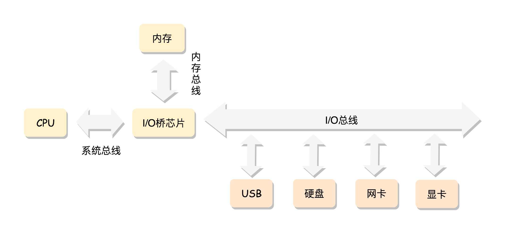
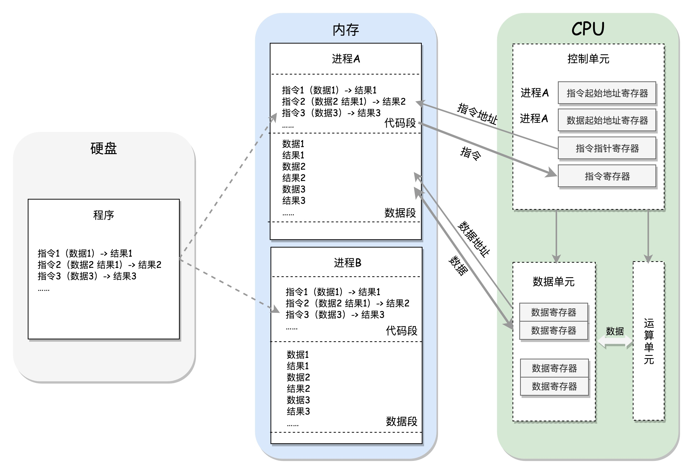

## 信息就是位+上下文

计算机系统由硬件和软件组成，它们共同工作来运行应用程序。系统中所有信息都是由一些列0和1所表示的。区分不同信息的唯一方法就是我们读到的这些0和1时的上下文。比如，在不同的上下文中，一个同样的字节序列可能表示一个整数、浮点数、字符串或者机器指令等。

## 计算机的工作模式

**CPU**

对于一个计算机来讲，最核心的就是**CPU**（Central Processing Unit，中央处理器）。它包括三个部分，**运算单元**、**数据单元**和**控制单元**。

进程一旦运行，就会有独立的内存空间，它互相隔离，比如图中两个进程 A 和 B。程序会分别加载到进程 A 和进程 B 的内存空间里面，形成各自的代码段。当然真实情况肯定比我说的要复杂的多，进程的内存除了简单的区分代码段和数据段，还会分的更细。

CPU 的控制单元里面，有一个**指令指针寄存器**，它里面存放的是下一条指令在内存中的地址。控制单元会不停地将代码段的指令拿进来，先放入指令寄存器。

指令分为两部分，一部分是做什么操作；一部分是操作哪些数据。

要执行这条指令，就要把第一部分交给运算单元，第二部分交给数据单元。

数据单元根据数据的地址，从数据段里读到数据寄存器里，就可以参与运算了。运算单元做完运算，产生的结果会暂存在数据单元的数据寄存器里。最终，会有指令将数据写回内存中的数据段。

**8086 处理器**

8086 处理器是x86 中最经典的一款处理器。虽然它已经很老了，但是咱们现在操作系统中的很多特性都和它有关。

**数据单元**

8086 处理器内部有8个通用寄存器，这些寄存器主要用于在计算过程中暂存数据。
4个数据寄存器：AX、BX、CX、DX；
2个地址指针寄存器：BP(base pointer),SP(stack pointer)；
2个变址寄存器：SI(source index),DI(destination index) 

AX、BX、CX、DX 可以分成两个 8 位的寄存器来使用，分别是 AH、AL、BH、BL、CH、CL、DH、DL，其中 H 就是 High（高位），L 就是 Low（低位）的意思。这样，比较长的数据也能暂存，比较短的数据也能暂存。

**控制单元**

- IP 寄存器就是指令指针寄存器（Instruction Pointer Register)，指向代码段中下一条指令的位置。CPU 会根据它来不断地将指令从内存的代码段中，加载到 CPU 的指令队列中，然后交给运算单元去执行。
- CS 就是代码段寄存器（Code Segment Register），通过它可以找到代码在内存中的位置；
- DS 是数据段的寄存器，通过它可以找到数据在内存中的位置。
- SS 是栈寄存器（Stack Register）。

**偏移量** ：对于一个段，有一个起始的地址，而段内的具体位置，我们称为偏移量。

**32 位处理器**

E是Extension扩展的意思。

其它都还好说，就是段寄存器（Segment Register）改动比较大。CS、SS、DS、ES 仍然是 16 位的，但是不再是段的起始地址。段的起始地址放在内存的某个地方。这个地方是一个表格，表格中的一项一项是**段描述符**（Segment Descriptor）。这里面才是真正的段的起始地址。而段寄存器里面保存的是在这个表格中的哪一项，称为**选择子**（Selector）。这样，将一个从段寄存器直接拿到的段起始地址，就变成了先间接地从段寄存器找到表格中的一项，再从表格中的一项中拿到段起始地址。这样段起始地址就会很灵活了。当然为了快速拿到段起始地址，段寄存器会从内存中拿到段描述符放入 CPU 的描述符高速缓存器中。

为了对这两种模式进行区分，我们将前一种模式称为**实模式**（Real Pattern），后一种模式称为**保护模式**（Protected Pattern）。

**内存**

从物理上来说， 内存是由一组动态随机存取存储器(DRAM)芯片组成的。 从逻辑上来说，存储
器是一个线性的字节数组， 每个字节都有其唯一的地址（数组索引）， 这些地址是从零开始
的。

**总线**

计算机的各个部件通过总线进行信息传递。总线上主要有两类数据，一个是地址数据，表示我想要的数据存在内存的哪个位置，这类总线叫**地址总线**（Address Bus）；另一类是真正的数据，这类总线叫**数据总线**（Data Bus）。

我们常说的总线有多少位，其实说的是总线一次能传输多大的数据。64位总线说的是，总线一次能传递64位，也就是8个字节的数据量。总线的位数也被称为字(Word)。

地址总线的位数，决定了能访问的地址范围到底有多广。例如32位的地址总线，2^32÷1024^3=4G，可以访问4G的内存空间。

## 基本汇编指令

- **mov** ：
  - 通用数据传输指令。把一个字节、字或双字的[操作数](https://baike.baidu.com/item/%E6%93%8D%E4%BD%9C%E6%95%B0)从源位置传送到目的位置，源操作数的内容不变。
  - 格式：MOV DST，SRC
  - 例子：MOV AX，DS（段寄存器DS至通用寄存器AX）
- **add** ：加法 add a b (a=a+b)
- **call** ：
- **jmp** ：
- **int** ：中断指令
- **ret** ：
- **or** : 或运算
- **xor** : 异或运算
- **shl** ：算术左移
- **shr** ： 算术右移
- **push** ：
- **pop** ：
- **inc** ：加1
- **dec** ：减1
- **sub** : 减法 sub a b (a=a-b)
- **cmp** : 减法比较，修改标志位

